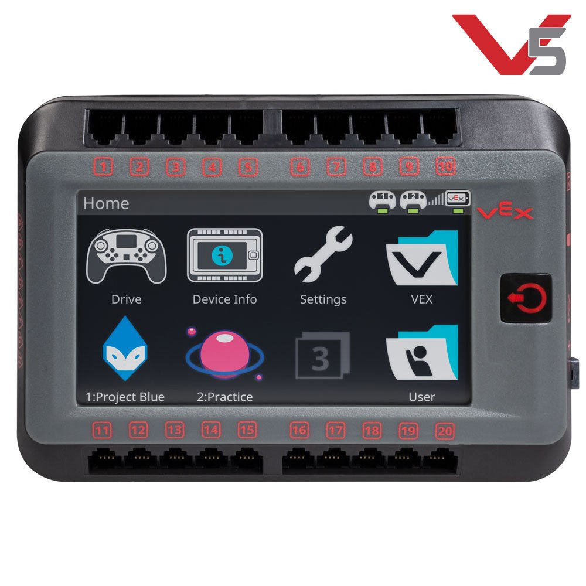
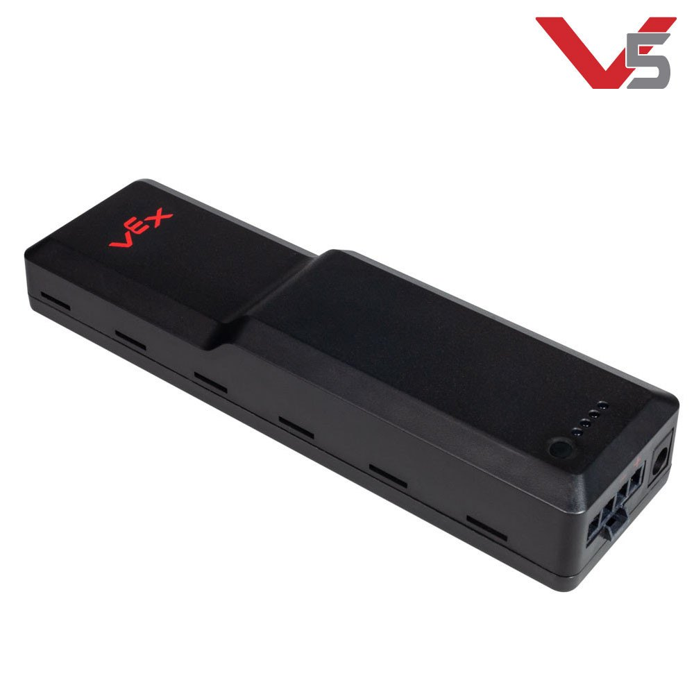
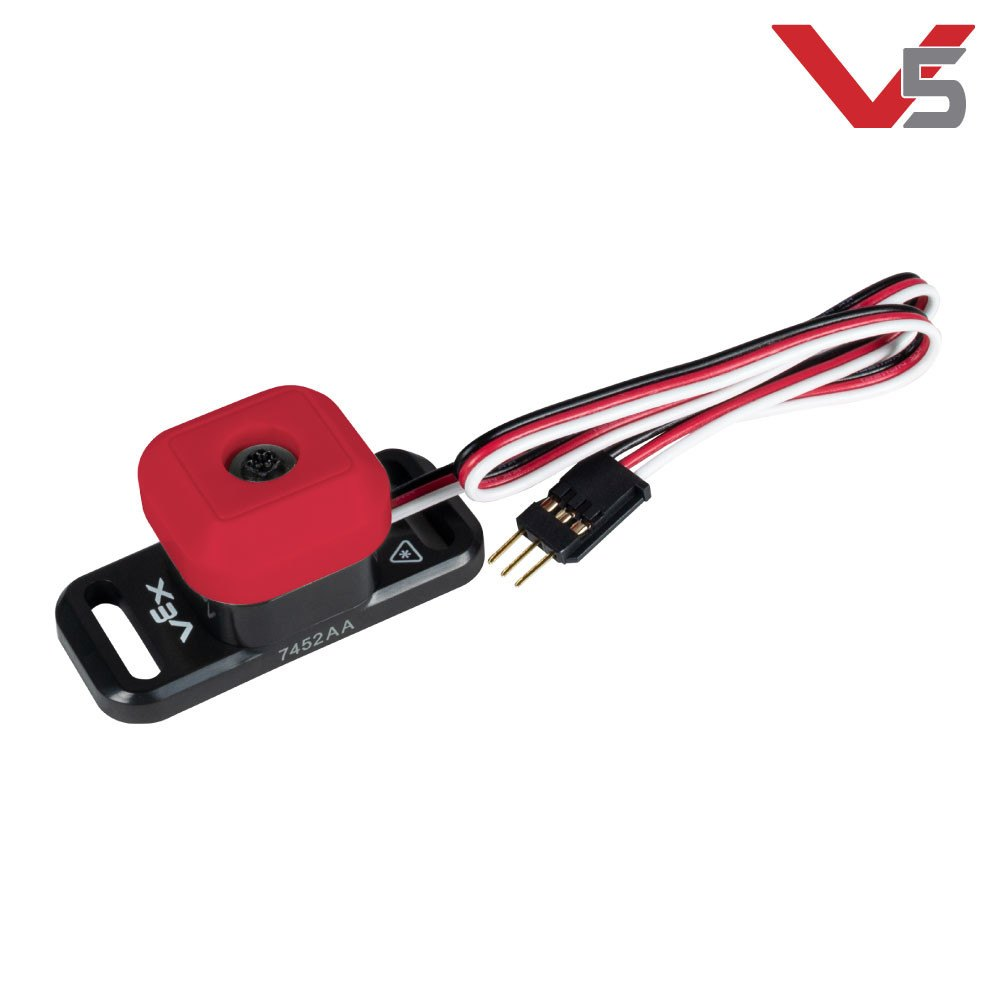

## Vélbúnaður
 | rafbúnaður | Magn | Myndir |
  | --- | --- | --- |
  | Robot Brain | 1 |   | 
  | Controller | 1 |  |
  | Robot Battery | 1 |    |
  | Robot Battery Cable | 1 |   |
  | Robot Battery Charger |  1|    |
  | Smart Motors | 4 |   |
  | Bumper Switch v2 | 1 |    |
  | Vision sensor | 1 |    |
  

Hérna er kittið sem við erum að nota:
https://www.vexrobotics.com/vexedr/products/v5-products/276-6500.html#Kit_Contents
